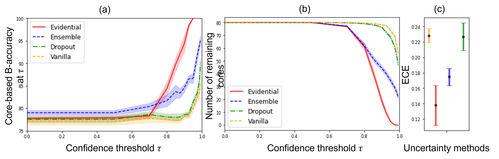

Towards Confident Detection of Prostate Cancer using High Resolution Micro-ultrasound
============================================


code for the paper [Towards Confident Detection of Prostate Cancer using High Resolution Micro-ultrasound](https://arxiv.org/pdf/2207.10485.pdf)

## Abstract
MOTIVATION: Detection of prostate cancer during transrectal ultrasound-guided biopsy is challenging. The highly heterogeneous appearance of cancer, presence of ultrasound artefacts, and noise
all contribute to these difficulties. Recent advancements in high-frequency
ultrasound imaging - micro-ultrasound - have drastically increased the
capability of tissue imaging at high resolution. Our aim is to investigate the development of a robust deep learning model specifically for
micro-ultrasound-guided prostate cancer biopsy. For the model to be
clinically adopted, a key challenge is to design a solution that can confidently identify the cancer, while learning from coarse histopathology
measurements of biopsy samples that introduce weak labels. METHODS: We use a dataset of micro-ultrasound images acquired from 194
patients, who underwent prostate biopsy. We train a deep model using a
co-teaching paradigm to handle noise in labels, together with an evidential deep learning method for uncertainty estimation. We evaluate the
performance of our model using the clinically relevant metric of accuracy
vs. confidence. RESULTS: Our model achieves a well-calibrated estimation of predictive uncertainty with area under the curve of 88%. The use
of co-teaching and evidential deep learning in combination yields significantly better uncertainty estimation than either alone. We also provide
a detailed comparison against state-of-the-art in uncertainty estimation
#### note that readme is not complete yet.

## Results
### Uncertainty Estimation

### Qualitative Results
Top row: cancer case, Bottom tow : non-cancer case, Left to right: predictions of model with different uncertainty thresholds

## Usage

### Data

The data used in this work is **private**.

## Citation

If you find this code useful, please consider citing our paper:

> Mahdi Gilany, Paul Wilson, Amoon Jamzad, Fahimeh Fooladgar, Minh To, Brian Wodlinger, Purang Abolmaesumi, Parvin Mousavi. Towards Confident Detection of Prostate Cancer Using High Resolution Micro-ultrasound. In International Conference on Medical Image Computing and Computer-Assisted Intervention (MICCAI). 2022. 

\* indicates equal contribution

```bibtex
@inproceedings{gilany2022towards,
  title={Towards Confident Detection of Prostate Cancer Using High Resolution Micro-ultrasound},
  author={Gilany, Mahdi and Wilson, Paul and Jamzad, Amoon and Fooladgar, Fahimeh and To, Minh Nguyen Nhat and Wodlinger, Brian and Abolmaesumi, Purang and Mousavi, Parvin},
  booktitle={International Conference on Medical Image Computing and Computer-Assisted Intervention},
  pages={411--420},
  year={2022},
  organization={Springer}
}
```